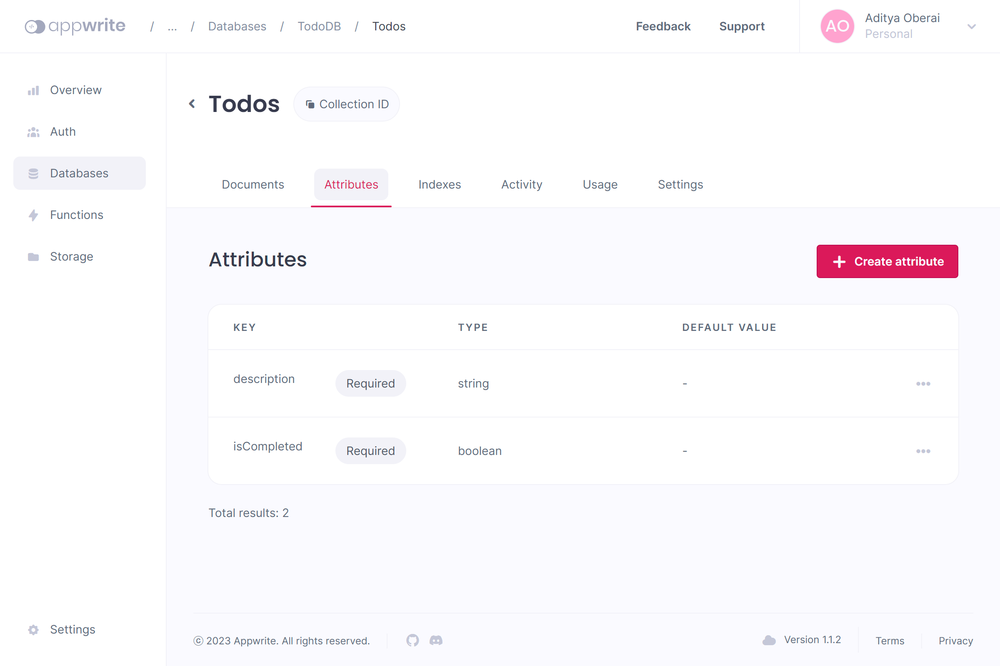

# .NET + Appwrite Todo API

## Description

Todo CRUD API built with Appwrite Cloud and .NET 7

## Installation

### Appwrite Setup

- Sign up for [Appwrite Cloud](https://cloud.appwrite.io/register)

  

- Create your first project

  

- Create an API Key with the scopes `documents.read` and `documents.write`

  

- Create a database, followed by a collection, and create the following attributes
    | Attribute ID | Type    | Size | Default Value | Required | Array |
    |--------------|---------|------|---------------|----------|-------|
    | description  | string  | 255  |               | Yes      | No    |
    | isCompleted  | boolean |      |               | Yes      | No    |

    
  
- Keep your Project Id, Database Id, Collection Id, and API Key saved for the project setup

### Project Setup

- Install the [.NET 7 SDK](https://dotnet.microsoft.com/en-us/download) if you haven't already

- Clone the repository
  ```sh
  https://github.com/adityaoberai/.NET-Appwrite-Todo-API.git
  ```
- Restore all NuGet packages
  ```sh
  dotnet restore
  ```
- Enter the project directory
  ```sh
  cd AppwriteCrudApi/
  ```
- Add the Project Id, Database Id, Collection Id, and API Key you saved from your Appwrite project in the `appsettings.json` file

- Run the project
  ```sh
  dotnet run
  ```
- Open the following URL in your browser
  ```
  https://localhost:7248/swagger
  ```
  
  OR

  ```
  http://localhost:5023/swagger
  ```
